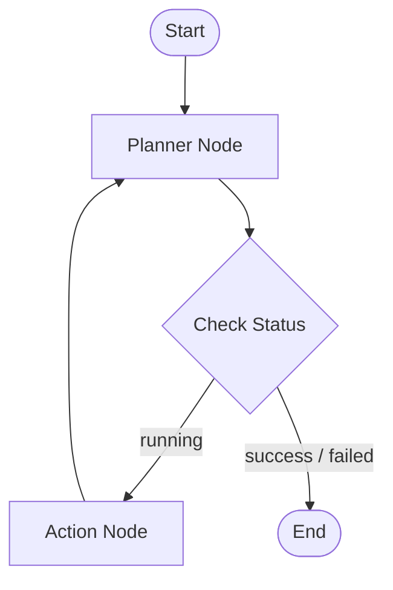

# CortexWeb Agent Architecture

This document describes the high-level architecture, design decisions, and components of the **CortexWeb Agent**.

---

## 1. System Design Diagram

The agent operates as an autonomous state machine compiled using LangGraph. The diagram below illustrates the state transition loop:

---

## 2. Core Modules & Responsibilities

The agent is modularized into distinct layers complying with the Single Responsibility Principle:

### A. Browser Automation Layer (`browser/`)
* **`BrowserController`**: Initializes the Playwright browser context, opens contexts/pages, performs navigations, captures screenshots, and closes the browser context.
* **`BrowserActions`**: High-level interaction wrapper executing raw actions like typing, clicking selectors, clicking visual coordinates, double-clicking, scrolling, and keypresses.
* **`ElementDetector`**: Employs a robust 4-level element locator fallback:
  1. **Semantic DOM Selection**: Resolves labels, placeholders, and ARIA labels.
  2. **CSS Selector Match**: Direct CSS selectors.
  3. **XPath Query**: Direct XPath queries.
  4. **Visual Multimodal Fallback**: Screenshot visual analyzer locating elements visually.

### B. Visual Multimodal Layer (`vision/`)
* **`ScreenshotAnalyzer`**: Sends page screenshots to OpenRouter's vision models using LangChain's `.with_structured_output` to visually resolve absolute screen coordinates `(x, y)` of elements when DOM strategies fail.

### C. Orchestration Brain (`agent/`)
* **`AgentState`**: A structured dictionary that tracks the task objective, tool execution history, page state (URL and screenshots), attempts, and next planned tool.
* **`AgentPlanner`**: Analyzes the objective, current state, and historical runs. Generates the structured output (`AgentAction`) containing reasoning thoughts and the next action tool/arguments.
* **`AgentMemory`**: Distills the running history into readable summaries and serializes final execution paths into `logs/run_memory.json`.

---

## 3. Tool Binding Layer (`tools/`)
Exposes browser interactions as standard LangChain tools (`@tool` decorator) with defined schemas, allowing the LangGraph orchestrator to dynamically trigger actions.
