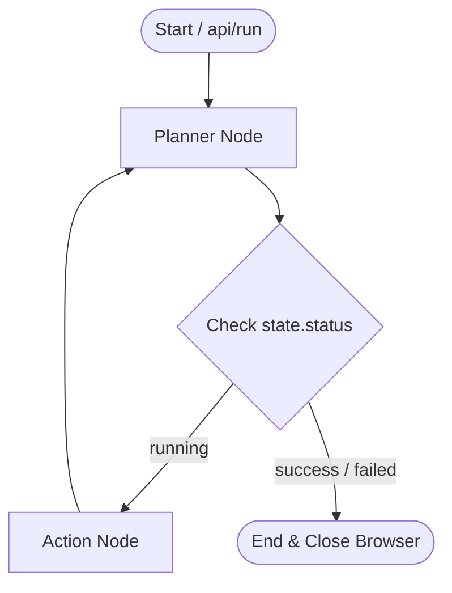

# CortexWeb System Architecture

This document outlines the system architecture, state flow, and design decisions behind **CortexWeb**.

---

## 1. System Topology & Event Loop

CortexWeb runs on a decoupled, multithreaded architecture to ensure responsiveness and cross-platform compatibility:

```
[ Frontend: HTML5 Dashboard ] <--- (SSE Stream) --- [ FastAPI Main Thread (Selector Loop) ]
                                                            |
                                                   (Thread-Safe Queue)
                                                            |
                                                   [ Worker Thread (Proactor Loop) ]
                                                            |
                                                   [ LangGraph State Loop ]
                                                            |
                                                   [ Playwright Chromium ]
```

### Decoupled Event Loops
* **ASGI Main Thread**: Runs FastAPI and standard HTTP/SSE connections. On Windows under Uvicorn reload, this thread defaults to `SelectorEventLoop`.
* **Worker Thread**: Initialized inside `/api/run` to bypass Windows loop compatibility limitations. Runs a `ProactorEventLoop` which Playwright requires to manage standard I/O pipes and Chromium subprocess processes.

---

## 2. State Machine Flow (LangGraph)

The orchestration engine is designed as a stateful graph machine built with `langgraph`.



### Agent State Dictionary (`AgentState`)
The global state acts as the short-term memory of the agent and is passed dynamically between nodes:
* `objective` (str): The high-level task.
* `history` (List[ToolExecution]): A list of all executed actions, arguments, and DOM/vision results.
* `current_url` (str): Tracks the browser's current active location.
* `screenshot_path` (str): Path to the latest viewport capture on disk.
* `next_tool` / `next_tool_args`: Stored decision from the planner.
* `thought` (str): Reasoning block for logs.
* `attempts` (int): Incrementing step counter (capped at 15 for safety).

---

## 3. Layered Components

### A. Semantic DOM & Visual Resolver (`browser/element_detector.py`)
Resolves visual elements by falling back sequentially across four execution plans:
1. **Accessibility Mapping**: Attempts locator lookup using accessibility labels, placeholders, and ARIA roles.
2. **Selector Querying**: Evaluates the input as a direct CSS or XPath string.
3. **Multimodal Coordinates**: Takes a temporary viewport screenshot, encodes it in Base64, and calls the vision model with instructions to locate the pixel centers on a normalized `1280x720` layout.
4. **Coordinate Click**: Fires physical mouse events directly via Playwright's viewport mouse actions.

### B. Structured Planner (`agent/planner.py`)
Interacts with the LLM via LangChain's structured output bindings. Forces the model output to comply with a strict Pydantic schema:
* `thought` (str): Detailed reasoning steps.
* `tool` (str): Matches a standard action (e.g. `navigate_to_url`, `fill_field`, `finish`).
* `args` (dict): Strict arguments parsed directly to the target Playwright tools.

### C. Execution Pipeline (`agent/executor.py`)
Maps the planner's output to active Python Playwright functions. It updates the state history list and handles automatic screenshot captures of successful actions and failure states.
